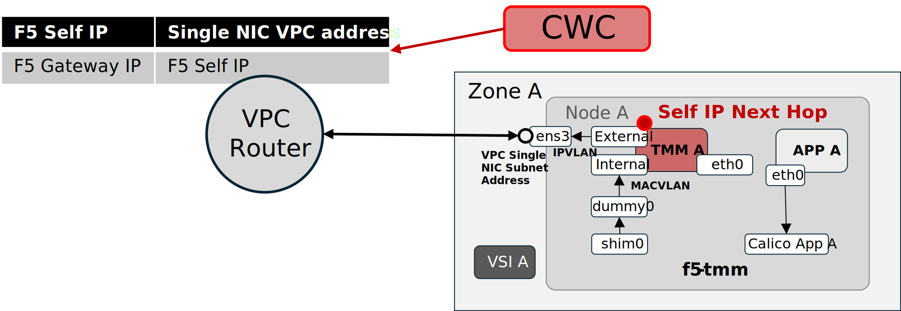
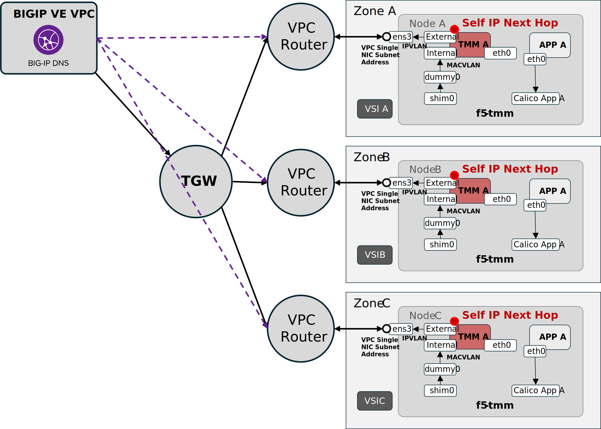
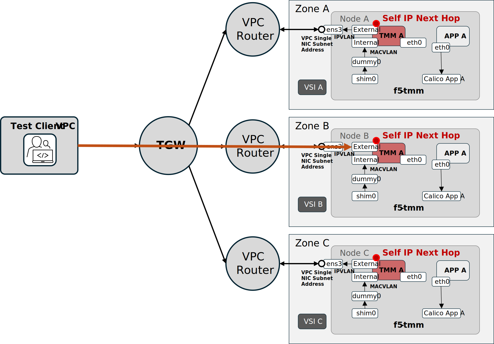
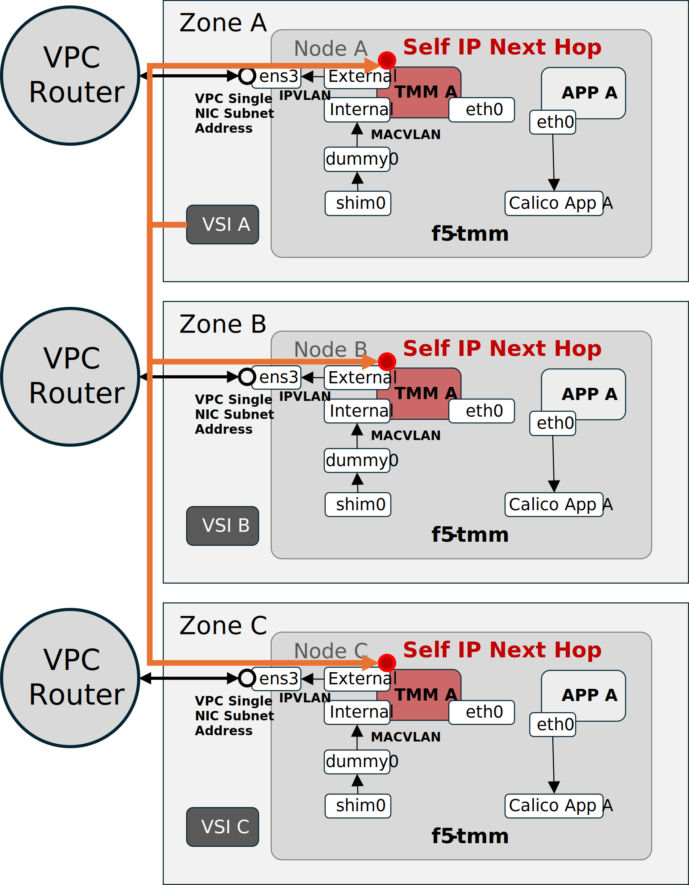
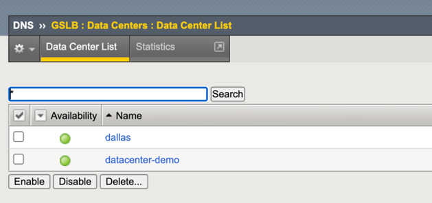
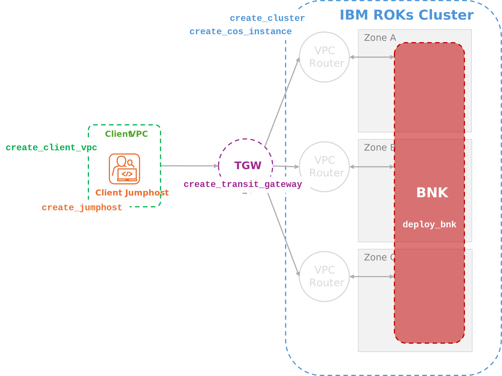

# BIG-IP Next for Kubernetes 2.3 — IBM Cloud Schematics Orchestration Workspace — build 2.3.0-ehf-2-3.2598.3-0.0.17

## About This Workspace

This is a Schematics orchestration workspace that chains six individual IBM Cloud Schematics workspaces to deploy BIG-IP Next for Kubernetes on an IBM Cloud ROKS cluster. It corresponds to the F5 engineering March 30th, 2026 demonstration of BIG-IP Next for Kubernetes installed in IBM Cloud ROKS clusters.

Each workspace in the chain is planned and applied in order (ws1 → ws6) and destroyed in reverse (ws6 → ws1). Outputs from each workspace are automatically wired as inputs to downstream workspaces.

| Workspace | Role |
|-----------|------|
| ws1 | ROKS cluster + Transit Gateway |
| ws2 | cert-manager Helm installation |
| ws3 | F5 Lifecycle Operator (FLO) |
| ws4 | CNEInstance custom resource |
| ws5 | License custom resource |
| ws6 | Testing jumphost infrastructure |

### Testable Deployment Features

#### What's New in 2.3.0-EHF-2-3.2598.3-0.0.17

- Static routing control of IBM Cloud VPC routers
- GSLB disaggregation ingress across IBM Cloud availability zones for BIG-IP Virtual Edition DNS Services
- External client service delivery through static VPC routes with attached IBM Cloud Transit Gateway
- Inter-VPC client service delivery through static VPC routes

#### VPC Static Route Orchestration via F5 CWC

F5 CWC controls IBM Cloud VPC static routes, using f5-tmm pod Self-IP addresses as next-hop addresses for ingress Gateway listeners and as egress SNAT addresses.



#### BIG-IP VE DNS Services / GSLB Integration

BIG-IP Virtual Edition DNS Services provides GSLB access to BIG-IP Next for Kubernetes ingress Gateway listener IP addresses.



#### Transit Gateway Client Access

Ingress and egress flows from an external VPC connected via IBM Cloud Transit Gateway (TGW), using a test client jumphost or other TGW-connected clients.



#### In-VPC Ingress from VSIs

Direct ingress from other Virtual Server Instances (VSIs) in the same VPC as the IBM ROKS cluster.



---

## Prerequisites for BIG-IP Virtual Edition DNS Service Testing

A VPC-deployed BIG-IP Virtual Edition with DNS Services enabled should be deployed in an external VPC and connected through an IBM Cloud TGW to the IBM ROKS cluster VPC.

A DNS Services GSLB Data Center must be deployed so that the BIG-IP Next for Kubernetes CWC controller can add Wide IPs and automate Wide IP pool membership with Gateway listener IP addresses.



The GSLB Data Center name will be required for the `cneinstance_gslb_datacenter_name` variable.

The iControl REST credentials to access the BIG-IP DNS Services appliance are defined by:

| Variable | Description | Example |
|----------|-------------|---------|
| `bigip_username` | BIG-IP username for CIS controller login | `admin` (default) |
| `bigip_password` | BIG-IP password for CIS controller login | (sensitive) |
| `bigip_url` | BIG-IP URL for CIS controller login | `https://10.100.100.22` |

The CIS controller, deployed within the IBM ROKS cluster, must be able to resolve the URL host and reach the iControl REST endpoint in the BIG-IP DNS Services appliance.

---

## Deploying with IBM Schematics

### IBM Cloud and Schematics Variables

| Variable | Description | Required | Default |
|----------|-------------|----------|---------|
| `ibmcloud_api_key` | IBM Cloud API key for all workspace operations | **REQUIRED** | — |
| `ibmcloud_schematics_region` | IBM Cloud Schematics service region | REQUIRED with default | `ca-tor` |
| `ibmcloud_cluster_region` | IBM Cloud region where ROKS cluster and VPC resources are created | REQUIRED with default | `ca-tor` |
| `ibmcloud_resource_group` | Resource group for all resources | REQUIRED with default | `default` |

### Feature Flags

This deployment is modular and presents the following feature flag variables that control which workspaces are planned, applied, and destroyed.



| Variable | Description | Required | Default |
|----------|-------------|----------|---------|
| `create_roks_cluster` | Create a new ROKS cluster (ws1). Set false to use an existing cluster via `roks_cluster_id_or_name` | REQUIRED with default | `true` |
| `create_roks_transit_gateway` | Create Transit Gateway and VPC connections (ws1) | REQUIRED with default | `true` |
| `create_roks_registry_cos_instance` | Create COS instance for the OpenShift image registry (ws1) | REQUIRED with default | `true` |
| `install_cert_manager` | Install cert-manager on the cluster (ws2). `cert_manager_namespace` is still passed to ws3 when false | REQUIRED with default | `true` |
| `deploy_bnk` | Deploy FLO (ws3), CNEInstance (ws4), and License (ws5) | REQUIRED with default | `true` |
| `testing_create_tgw_jumphost` | Create a jumphost in a client VPC connected via Transit Gateway (ws6) | REQUIRED with default | `true` |
| `testing_create_cluster_jumphosts` | Create one jumphost per availability zone inside the cluster VPC (ws6) | REQUIRED with default | `false` |

### ROKS Cluster Variables (ws1)

| Variable | Description | Required | Default |
|----------|-------------|----------|---------|
| `roks_cluster_id_or_name` | ID or name of an existing cluster. Required when `create_roks_cluster = false` | Conditional | `""` |
| `roks_cluster_vpc_name` | Name of the cluster VPC | REQUIRED with default | `tf-cluster-vpc` |
| `openshift_cluster_name` | Name of the OpenShift cluster | REQUIRED with default | `tf-openshift-cluster` |
| `openshift_cluster_version` | OpenShift version. Leave empty for latest | REQUIRED with default | `4.18` |
| `roks_workers_per_zone` | Worker nodes per availability zone | REQUIRED with default | `1` |
| `roks_min_worker_vcpu_count` | Minimum vCPU count for auto-selecting the worker node flavor | REQUIRED with default | `16` |
| `roks_min_worker_memory_gb` | Minimum memory (GB) for auto-selecting the worker node flavor | REQUIRED with default | `64` |
| `roks_cos_instance_name` | Name of the COS instance for the OpenShift image registry | REQUIRED with default | `tf-openshift-cos-instance` |
| `roks_transit_gateway_name` | Name of the Transit Gateway. When `create_roks_transit_gateway = false` and `testing_create_tgw_jumphost = true`, set this to the name of the existing TGW connected to the cluster VPC | REQUIRED with default | `tf-tgw` |

### cert-manager Variables (ws2)

| Variable | Description | Required | Default |
|----------|-------------|----------|---------|
| `cert_manager_namespace` | Kubernetes namespace for cert-manager | REQUIRED with default | `cert-manager` |
| `cert_manager_version` | cert-manager Helm chart version | REQUIRED with default | `v1.17.3` |

### COS Bucket Variables — shared by FLO (ws3) and License (ws5)

When deploying with IBM Schematics, FAR container pull credentials and the JWT license token should be stored in an IBM Cloud Object Storage bucket. Download both from [myf5.com](https://my.f5.com) and upload them to a COS bucket.

```
bnk-orchestration            # IBM COS Instance (ibmcloud_cos_instance_name)
└── bnk-schematics-resources # IBM COS Bucket   (ibmcloud_resources_cos_bucket)
    ├── f5-far-auth-key.tgz  # FAR pull secret  (f5_cne_far_auth_file)
    └── trial.jwt            # License JWT       (f5_cne_subscription_jwt_file)
```

| Variable | Description | Required | Default |
|----------|-------------|----------|---------|
| `ibmcloud_cos_bucket_region` | IBM Cloud region where the COS bucket is located | REQUIRED with default | `us-south` |
| `ibmcloud_cos_instance_name` | IBM Cloud COS instance name | REQUIRED with default | `bnk-orchestration` |
| `ibmcloud_resources_cos_bucket` | IBM Cloud COS bucket containing FAR auth key and JWT files | REQUIRED with default | `bnk-schematics-resources` |

### BIG-IP Next for Kubernetes Variables — FLO / CNEInstance / License (ws3–ws5)

( Feature Flag: `deploy_bnk` )

#### FLO — F5 Lifecycle Operator (ws3)

| Variable | Description | Required | Default |
|----------|-------------|----------|---------|
| `far_repo_url` | FAR repository URL for Docker and Helm images | REQUIRED with default | `repo.f5.com` |
| `f5_bigip_k8s_manifest_version` | Version of the f5-bigip-k8s-manifest chart. FLO and CIS versions are extracted from this | **REQUIRED** | `2.3.0-bnpp-ehf-2-3.2598.3-0.0.17` |
| `f5_cne_far_auth_file` | FAR auth key filename in the COS bucket (.tgz) | REQUIRED with default | `f5-far-auth-key.tgz` |
| `f5_cne_subscription_jwt_file` | Subscription JWT filename in the COS bucket | REQUIRED with default | `trial.jwt` |
| `flo_namespace` | Kubernetes namespace for the F5 Lifecycle Operator | REQUIRED with default | `f5-bnk` |
| `flo_utils_namespace` | Kubernetes namespace for F5 utility components | REQUIRED with default | `f5-utils` |
| `bigip_username` | BIG-IP username for the CIS controller. Leave blank if not using CIS | REQUIRED with default | `admin` |
| `bigip_password` | BIG-IP password for the CIS controller. Leave blank if not using CIS | Conditional | `""` |
| `bigip_url` | BIG-IP URL for the CIS controller. Leave blank if not using CIS | Conditional | `""` |

#### CNEInstance (ws4)

| Variable | Description | Required | Default |
|----------|-------------|----------|---------|
| `cneinstance_deployment_size` | Deployment size. Options: `Small`, `Medium`, `Large` | REQUIRED with default | `Small` |
| `cneinstance_gslb_datacenter_name` | GSLB datacenter name. Leave empty if not using GSLB | Optional | `""` |

#### License (ws5)

| Variable | Description | Required | Default |
|----------|-------------|----------|---------|
| `license_mode` | License operation mode. Options: `connected`, `disconnected` | REQUIRED with default | `connected` |

### Testing Jumphost Variables (ws6)

| Variable | Description | Required | Default |
|----------|-------------|----------|---------|
| `testing_ssh_key_name` | Name of an existing IBM Cloud SSH key to inject into all jumphosts | **REQUIRED** | `""` |
| `testing_jumphost_profile` | Instance profile for jumphosts. Leave empty to auto-select | Optional | `""` |
| `testing_min_vcpu_count` | Minimum vCPU count for auto-selecting the jumphost profile | REQUIRED with default | `4` |
| `testing_min_memory_gb` | Minimum memory (GB) for auto-selecting the jumphost profile | REQUIRED with default | `8` |
| `testing_create_client_vpc` | Create a new client VPC for the TGW jumphost. When false, `testing_client_vpc_name` must reference an existing VPC | REQUIRED with default | `false` |
| `testing_client_vpc_name` | Name of the client VPC for the TGW jumphost | REQUIRED with default | `tf-testing-vpc` |
| `testing_client_vpc_region` | IBM Cloud region for the client VPC and TGW jumphost | REQUIRED with default | `ca-tor` |
| `testing_tgw_jumphost_name` | Name of the TGW-connected jumphost instance | REQUIRED with default | `tf-testing-jumphost-tgw` |
| `testing_cluster_jumphost_name_prefix` | Name prefix for cluster jumphosts. Zone is appended: `<prefix>-<zone>` | REQUIRED with default | `tf-testing-jumphost-cluster` |

### Template Repo URL Variables

By default each workspace pulls from the corresponding `f5devcentral` GitHub repo on `main`. Override these to point workspaces at a fork or feature branch.

| Variable | Default |
|----------|---------|
| `roks_cluster_template_repo_url` | `https://github.com/f5devcentral/ibmcloud_schematics_bigip_next_for_kubernetes_roks_cluster_4_18` |
| `cert_manager_template_repo_url` | `https://github.com/f5devcentral/ibmcloud_schematics_bigip_next_for_kubernetes_2_3_cert_manager` |
| `flo_template_repo_url` | `https://github.com/f5devcentral/ibmcloud_schematics_bigip_next_for_kubernetes_2_3_flo` |
| `cneinstance_template_repo_url` | `https://github.com/f5devcentral/ibmcloud_schematics_bigip_next_for_kubernetes_2_3_cneinstance` |
| `license_template_repo_url` | `https://github.com/f5devcentral/ibmcloud_schematics_bigip_next_for_kubernetes_2_3_license` |
| `testing_template_repo_url` | `https://github.com/f5devcentral/ibmcloud_schematics_bigip_next_for_kubernetes_2_3_testing` |

---

## IBM Cloud CLI Deployment

See [IBMCLOUD_CLI.md](./IBMCLOUD_CLI.md) for full instructions on using the IBM Cloud CLI to:

- Generate `workspace.json` from `terraform.tfvars` using `tfvars_to_schematics_input_json.py`
- Create the orchestration workspace
- Trigger plan, apply, and destroy
- Update variables and stream job logs

---

## OCP Security Context Constraints Bindings Detail

BIG-IP Next for Kubernetes required bindings grant `system:openshift:scc:privileged` for the following resources:

| Workspace | Namespace | Service Accounts |
|-----------|-----------|------------------|
| ws3 — FLO | `f5-bnk` | `flo-f5-lifecycle-operator`, `f5-bigip-ctlr-serviceaccount`, `default` (CIS) |
| ws4 — CNEInstance | `f5-bnk` | `tmm-sa`, `f5-dssm`, `f5-downloader`, `f5-afm`, `f5-cne-controller-*`, `f5-cne-env-discovery-serviceaccount` |
| ws4 — CNEInstance | `f5-utils` | `crd-installer`, `cwc`, `f5-coremond`, `f5-rabbitmq`, `f5-observer-operator`, `f5-ipam-ctlr`, `otel-sa`, `f5-crdconversion`, `default` |

---

## Project Structure

```
ibmcloud_schematics_bigip_next_for_kubernetes_2_3/
├── main.tf                                  # 6 Schematics workspace resources + output data sources + locals
├── variables.tf                             # Root module input variables
├── outputs.tf                               # Root module outputs (ws1–ws6)
├── jobs.tf                                  # Plan, apply, and destroy job orchestration
├── providers.tf                             # IBM Cloud provider configuration
├── versions.tf                              # Terraform and provider version constraints
├── terraform.tfvars.example                 # All variables with default values
├── ibmcloud_cli_input_variables.json.example# Variables in Schematics JSON format
├── tfvars_to_schematics_input_json.py       # Converts terraform.tfvars → workspace.json
├── IBMCLOUD_CLI.md                          # IBM Cloud CLI deployment guide
└── assets/
    └── images/                              # Architecture and feature diagrams
```

---

## Workspace Dependency Chain

```
┌──────────────────────────────────────────────────┐
│  ws1 — ROKS Cluster + Transit Gateway            │
│  (Feature flags: create_roks_cluster,            │
│   create_roks_transit_gateway,                   │
│   create_roks_registry_cos_instance)             │
│                                                  │
│  - VPC & subnets                                 │
│  - OpenShift ROKS cluster                        │
│  - Transit Gateway                               │
│  - COS instance (OpenShift registry)             │
└───────────────────────┬──────────────────────────┘
                        │ cluster name, TGW name
                        ▼
┌──────────────────────────────────────────────────┐
│  ws2 — cert-manager                             │
│  (Feature flag: install_cert_manager)           │
│                                                  │
│  - Namespace                                     │
│  - Helm release                                  │
│  - CRD registration                             │
└───────────────────────┬──────────────────────────┘
                        │ cert_manager_namespace
                        ▼
┌──────────────────────────────────────────────────┐
│  ws3 — FLO (F5 Lifecycle Operator)              │
│  (Feature flag: deploy_bnk)                     │
│                                                  │
│  - cert-manager ClusterIssuer + Certificates    │
│  - NAD (Network Attachments)                    │
│  - F5 Lifecycle Operator Helm                   │
│  - F5 BNK CIS Helm + BIG-IP login secret        │
│  - IBM IAM Trusted Profile                      │
│  - privileged SCC (3 bindings)                  │
└───────────────────────┬──────────────────────────┘
                        │ flo_namespace, flo_trusted_profile_id,
                        │ flo_cluster_issuer_name,
                        │ cneinstance_network_attachments
                        ▼
┌──────────────────────────────────────────────────┐
│  ws4 — CNEInstance                              │
│  (Feature flag: deploy_bnk)                     │
│                                                  │
│  - CNEInstance custom resource                  │
│  - privileged SCC (16 bindings)                 │
│  - Pod health validation                        │
└───────────────────────┬──────────────────────────┘
                        │ (License CRD registered)
                        ▼
┌──────────────────────────────────────────────────┐
│  ws5 — License                                  │
│  (Feature flag: deploy_bnk)                     │
│                                                  │
│  - License custom resource (k8s.f5net.com/v1)   │
│  - JWT + operation mode                         │
└───────────────────────┬──────────────────────────┘
                        │
                        ▼
┌──────────────────────────────────────────────────┐
│  ws6 — Testing Jumphosts                        │
│  (Feature flags: testing_create_tgw_jumphost,   │
│   testing_create_cluster_jumphosts)             │
│                                                  │
│  - Client VPC (optional)                        │
│  - TGW-connected jumphost                       │
│  - Per-zone cluster jumphosts (optional)        │
└──────────────────────────────────────────────────┘
```

**Plan and apply** run ws1 → ws6 sequentially. **Destroy** runs ws6 → ws1 via `null_resource` destroy provisioners that call the Schematics REST API before Terraform removes the workspace resources.

---

## Outputs

After apply, retrieve all workspace outputs from the IBM Cloud console or CLI:

```bash
ibmcloud schematics output --id $WS_ID
```

Key outputs include:

| Output | Description |
|--------|-------------|
| `ws1_openshift_cluster_name` | Name of the ROKS cluster |
| `ws1_openshift_cluster_public_endpoint` | Public API endpoint |
| `ws1_roks_transit_gateway_name` | Name of the Transit Gateway |
| `ws3_flo_trusted_profile_id` | IBM IAM Trusted Profile ID |
| `ws3_flo_pod_deployment_status` | FLO pod readiness status |
| `ws4_cneinstance_pod_deployment_status` | CNEInstance pod readiness status |
| `ws5_license_id` | Name of the License custom resource |
| `ws6_testing_tgw_jumphost_public_ip` | Floating IP of the TGW jumphost |
| `ws6_testing_tgw_jumphost_ssh_command` | SSH command to connect to the TGW jumphost |
| `ws6_testing_cluster_jumphost_ssh_commands` | SSH commands for per-zone cluster jumphosts |
