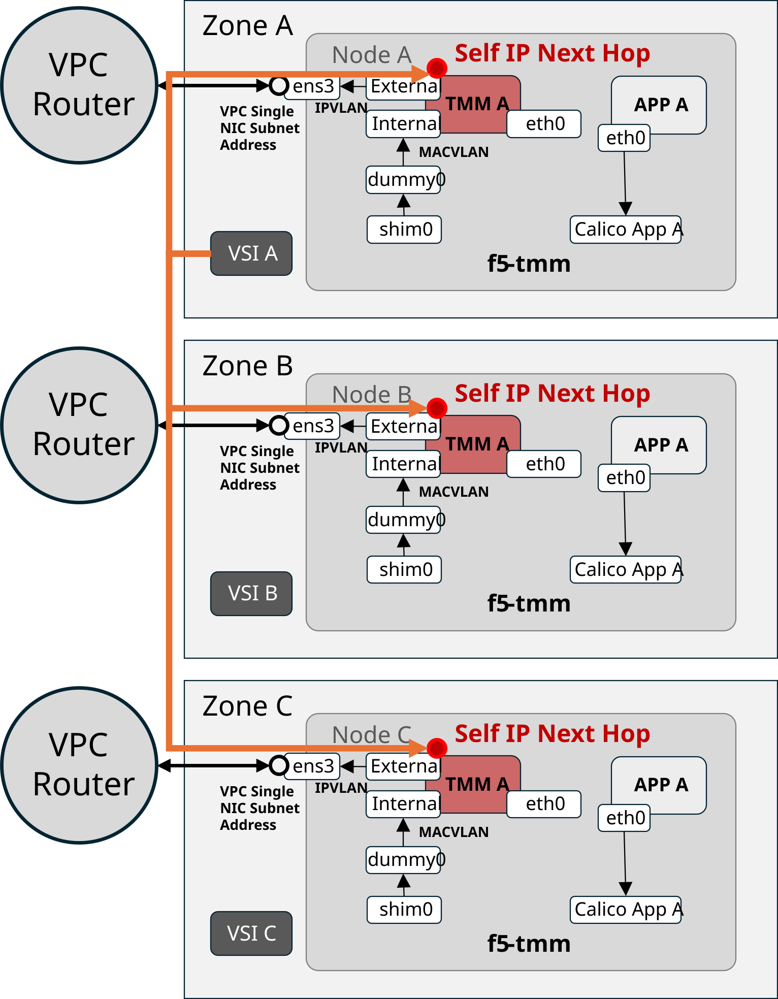

# BIG-IP Next for Kubernetes 2.3 — IBM Cloud Schematics Orchestration Workspace 

## About This Workspace

This repository is the **orchestration layer** for deploying BIG-IP Next for Kubernetes 2.3 on an IBM Cloud ROKS cluster. It corresponds to the 2.3 release of BIG-IP Next for Kubernetes installed in IBM Cloud ROKS clusters.

It is a single Terraform module that, when applied, creates **six child IBM Cloud Schematics workspaces** — one per deployment stage. Each child workspace pulls its own template repo, holds its own state, and is planned, applied, and destroyed in dependency order.

```
┌────────────────────────────────────────────────────────────────────┐
│  Orchestration workspace  (this repo)                              │
│  github.com/f5devcentral/ibmcloud_schematics_bigip_next_for_       │
│                          kubernetes_2_3                            │
│                                                                    │
│  Terraform creates six ibm_schematics_workspace resources +        │
│  destroy hooks (jobs.tf). Plan/apply of the children is driven     │
│  externally via the Schematics CLI (see Script Utilities).         │
└────────────────────────────────────────────────────────────────────┘
        │  creates and wires inputs/outputs between
        ▼
┌────────────┬────────────┬────────────┬────────────┬────────────┬────────────┐
│ ws1        │ ws2        │ ws3        │ ws4        │ ws5        │ ws6        │
│ ROKS       │ cert-      │ FLO        │ CNE-       │ License    │ Testing    │
│ cluster +  │ manager    │ (F5 Life-  │ Instance   │ custom     │ jumphost   │
│ Transit    │ Helm       │ cycle      │ custom     │ resource   │ infra      │
│ Gateway    │ install    │ Operator)  │ resource   │            │            │
└────────────┴────────────┴────────────┴────────────┴────────────┴────────────┘
   plan/apply  ws1 → ws6           destroy  ws6 → ws1
```

Outputs from each child workspace are read by the orchestration workspace and forwarded as inputs to downstream children — for example, the cluster name produced by ws1 is wired into ws2–ws6, and the trusted-profile ID and cluster-issuer name produced by ws3 are wired into ws4.

| Child workspace | Role | Template repo (default branch: `main`) |
|-----------------|------|------------------------------------------|
| ws1 | ROKS cluster + Transit Gateway + registry COS      | [ibmcloud_schematics_bigip_next_for_kubernetes_roks_cluster_4](https://github.com/f5devcentral/ibmcloud_schematics_bigip_next_for_kubernetes_roks_cluster_4) |
| ws2 | cert-manager Helm install                          | [ibmcloud_schematics_bigip_next_for_kubernetes_2_3_cert_manager](https://github.com/f5devcentral/ibmcloud_schematics_bigip_next_for_kubernetes_2_3_cert_manager) |
| ws3 | F5 Lifecycle Operator + CIS + IAM Trusted Profile  | [ibmcloud_schematics_bigip_next_for_kubernetes_2_3_flo](https://github.com/f5devcentral/ibmcloud_schematics_bigip_next_for_kubernetes_2_3_flo) |
| ws4 | CNEInstance custom resource                        | [ibmcloud_schematics_bigip_next_for_kubernetes_2_3_cneinstance](https://github.com/f5devcentral/ibmcloud_schematics_bigip_next_for_kubernetes_2_3_cneinstance) |
| ws5 | License custom resource                            | [ibmcloud_schematics_bigip_next_for_kubernetes_2_3_license](https://github.com/f5devcentral/ibmcloud_schematics_bigip_next_for_kubernetes_2_3_license) |
| ws6 | Jumphost test infrastructure                       | [ibmcloud_schematics_bigip_next_for_kubernetes_2_3_testing](https://github.com/f5devcentral/ibmcloud_schematics_bigip_next_for_kubernetes_2_3_testing) |

Each child workspace's repo URL and branch can be overridden via the `*_template_repo_url` / `*_template_repo_branch` variables (see [Template repo URLs](#template-repo-urls)) — useful for testing forks or feature branches.

> **Important — applying the orchestration workspace alone does not deploy anything.** It creates the six child workspace records (plus reverse-order destroy hooks) but does **not** plan or apply them. Plan/apply of ws1 → ws6 is driven by the script utilities documented below, which interleave plan→apply per workspace. This separation is required because ws2–ws6 read live cluster state at plan time and would fail if planned before ws1 has applied.

### Testable Deployment Features

#### What's New in 2.3

- Static routing control of IBM Cloud VPC routers
- GSLB disaggregation ingress across IBM Cloud availability zones for BIG-IP Virtual Edition DNS Services
- External client service delivery through static VPC routes with attached IBM Cloud Transit Gateway
- Inter-VPC client service delivery through static VPC routes

#### VPC Static Route Orchestration via F5 CWC

F5 CWC controls IBM Cloud VPC static routes, using f5-tmm pod Self-IP addresses as next-hop addresses for ingress Gateway listeners and as egress SNAT addresses.


#### BIG-IP VE DNS Services / GSLB Integration

BIG-IP Virtual Edition DNS Services provides GSLB access to BIG-IP Next for Kubernetes ingress Gateway listener IP addresses.


#### Transit Gateway Client Access

Ingress and egress flows from an external VPC connected via IBM Cloud Transit Gateway (TGW), using a test client jumphost or other TGW-connected clients.


#### In-VPC Ingress from VSIs

Direct ingress from other Virtual Server Instances (VSIs) in the same VPC as the IBM ROKS cluster.



---

## Prerequisites

### IBM Cloud account access

- IBM Cloud API key with permission to create Schematics workspaces and the resources in each child template (VPC, ROKS, Transit Gateway, COS, IAM trusted profiles, VSI).
- An IBM Cloud SSH key (referenced by `testing_ssh_key_name`) already created in the target region for jumphost access.

### Local tooling

| Tool | Used by |
|------|---------|
| `ibmcloud` CLI + `schematics` plugin | All deployment paths |
| `terraform` ≥ 1.5 | `all_in_one.sh`, `run_tests.sh` |
| `python3` | `tfvars_to_schematics_input_json.py`, `schematics_runner.py` |

Authenticate before running any script:

```bash
ibmcloud login --apikey "$IBMCLOUD_API_KEY" -r "$IBMCLOUD_REGION"
```

### COS bucket — FAR pull credentials and license JWT

ws3 (FLO) and ws5 (License) read the FAR auth key and the JWT license token from an IBM Cloud Object Storage bucket. Download both from [myf5.com](https://my.f5.com) and upload them:

```
bnk-orchestration            # IBM COS Instance (ibmcloud_cos_instance_name)
└── bnk-schematics-resources # IBM COS Bucket   (ibmcloud_resources_cos_bucket)
    ├── f5-far-auth-key.tgz  # FAR pull secret  (f5_cne_far_auth_file)
    └── trial.jwt            # License JWT       (f5_cne_subscription_jwt_file)
```

### Optional — BIG-IP Virtual Edition DNS Service for GSLB testing

A VPC-deployed BIG-IP Virtual Edition with DNS Services should be deployed in an external VPC connected through an IBM Cloud TGW to the cluster VPC, with a GSLB Data Center created. The data center name goes into `cneinstance_gslb_datacenter_name`.


| Variable | Description | Example |
|----------|-------------|---------|
| `bigip_username` | BIG-IP username for the CIS controller | `admin` (default) |
| `bigip_password` | BIG-IP password for the CIS controller | (sensitive) |
| `bigip_url` | BIG-IP iControl REST URL | `https://10.100.100.22` |

The CIS controller, running inside the ROKS cluster, must be able to resolve the URL host and reach the iControl REST endpoint.

---

## Script Utilities

Four utilities live at the repo root. Each plays a distinct role in the orchestration / child-workspace layering.

| Script | What it operates on | Schematics calls | Local Terraform |
|--------|---------------------|------------------|-----------------|
| `tfvars_to_schematics_input_json.py` | `terraform.tfvars` → `workspace.json` | none | none |
| `all_in_one.sh` | Local Terraform module + child workspaces | plan/apply ws1→ws6, destroy ws6→ws1 | yes (`-target` apply for child-workspace records and destroy hooks) |
| `schematics_runner.py` | Orchestration workspace + child workspaces | full lifecycle for both layers | none |
| `run_tests.sh` | Wraps `all_in_one.sh` for four scenarios | via `all_in_one.sh` | yes (per-scenario `terraform plan`) |

### `tfvars_to_schematics_input_json.py`

Converts `terraform.tfvars` to the JSON `variablestore` format that
`ibmcloud schematics workspace new --file workspace.json` expects. Detects
`bool` / `number` / `string` automatically and marks `ibmcloud_api_key` and
`bigip_password` as `secure`. Used by `schematics_runner.py` and by anyone
creating the orchestration workspace by hand.

```bash
cp terraform.tfvars.example terraform.tfvars
# edit terraform.tfvars — at minimum set ibmcloud_api_key and testing_ssh_key_name
python3 tfvars_to_schematics_input_json.py
# writes workspace.json
```

### `all_in_one.sh` — local Terraform driver

Single-deployment driver. Runs the orchestration Terraform **locally** and
drives child-workspace plan/apply via the Schematics CLI.

What it does on apply:

1. `terraform init`
2. `terraform apply -target` for the six `ibm_schematics_workspace` resources and the `null_resource.destroy_wsN` hooks. (Other resources in `jobs.tf` are skipped — see note below.)
3. Interleaved **plan → apply** for ws1 → ws6 via `ibmcloud schematics`, polling each job to completion before the next.
4. After ws3 apply, patches ws4's variablestore with the ws3 outputs (`flo_trusted_profile_id`, `flo_cluster_issuer_name`, `cneinstance_network_attachments`).
5. Final `terraform apply -target` of the read-back data sources so `terraform output` shows the deployed values.

```bash
./all_in_one.sh                              # default: terraform.tfvars, deploy ws1 → ws6
./all_in_one.sh path/to/other.tfvars         # alternate tfvars
./all_in_one.sh --destroy                    # destroy ws6 → ws1, then remove the orchestration state
./all_in_one.sh --destroy path/to/other.tfvars
./all_in_one.sh --help
```

Per-run logs land in `deploy-logs/deploy_<UTC-timestamp>.log`. The teardown
path fires the `null_resource.destroy_wsN` hooks created in step 2, which
POST to the Schematics destroy API for ws6 → ws1 in the correct reverse
order.

> Why the `-target`: the orchestration apply intentionally does **not** call plan/apply of the child workspaces from inside Terraform. Such provisioners would be fire-and-forget and downstream plans would race ahead of upstream applies — failing because data sources read live cluster state at plan time.

### `schematics_runner.py` — Schematics-native lifecycle runner

End-to-end runner that drives **both layers from the Schematics CLI** — no
local `terraform` invocation. Suitable for CI or operators who want every
state file held in IBM Cloud.

Phases (in execution order):

| Phase | What it does |
|-------|--------------|
| `create` | Create the orchestration workspace (uses `tfvars_to_schematics_input_json.py`) |
| `plan-orch` | Plan the orchestration workspace (validate HCL) |
| `apply-orch` | Apply the orchestration workspace — creates ws1 → ws6 records |
| `sub-ws` | Interleaved plan → apply for each child workspace ws1 → ws6 |
| `destroy-sub` | Destroy ws6 → ws1, skipping any that were never applied |
| `destroy-orch` | Destroy the orchestration workspace (fires `when=destroy` provisioners) |
| `delete` | Delete the orchestration workspace record |

```bash
# Full lifecycle (default — runs every phase)
python3 schematics_runner.py terraform.tfvars

# Create + plan + apply only, leave it standing
python3 schematics_runner.py terraform.tfvars \
    --phases create plan-orch apply-orch sub-ws

# Destroy a workspace that was created earlier
python3 schematics_runner.py terraform.tfvars \
    --ws-id ca-tor.workspace.bnk-23-orchestration.xxxxxxxx \
    --phases destroy-sub destroy-orch delete

# Test against a non-default branch of this repo
python3 schematics_runner.py terraform.tfvars --branch my-feature

# Inspection helpers (no changes)
python3 schematics_runner.py --list                         # show orchestration + child workspace tree
python3 schematics_runner.py --outputs --ws-id <WS_ID>      # print orchestration outputs
```

Reports and full logs are written to `test-reports/lifecycle_<UTC-timestamp>.txt` and `test-reports/lifecycle_<UTC-timestamp>_logs.txt`.

`--ws-id` is required for any phase other than `create` if `create` is not in `--phases`.

### `run_tests.sh` — scenario test suite

Wraps `all_in_one.sh` to exercise four deployment scenarios end-to-end and
print a PASS / FAIL summary. Each scenario runs three phases:

| Phase | What `run_tests.sh` does | Logged to |
|-------|--------------------------|-----------|
| `plan` | `terraform init` + `terraform plan` against this orchestration module (no Schematics calls) | `phase-plan.log` |
| `apply` | `./all_in_one.sh <tfvars>` — drives ws1 → ws6 plan/apply via the Schematics CLI | `phase-apply.log` |
| `destroy` | `./all_in_one.sh --destroy <tfvars>` — fires `destroy_wsN` hooks (ws6 → ws1) and removes the orchestration state | `phase-destroy.log` |

A failed plan skips that scenario's apply and destroy. A failed apply still attempts a cleanup destroy (unless `--no-destroy` is set).

#### Scenarios

| ID | Label | `create_roks_cluster` | `create_roks_transit_gateway` | `install_cert_manager` | `deploy_bnk` |
|----|-------|-----------------------|-------------------------------|------------------------|--------------|
| 1 | `full` | true | true | true | true |
| 2 | `existing-cluster-create-tgw` | false | true | false | true |
| 3 | `existing-cluster-existing-tgw` | false | false | false | true |
| 4 | `existing-cluster-create-tgw-existing-cert-manager` | false | true | false | true |

Scenarios 2–4 share a one-time prereqs deployment that creates the ROKS cluster, Transit Gateway, and cert-manager and tears them down after the three scenarios finish. (Their `install_cert_manager=false` avoids colliding on the same Helm release.)

Each scenario runs in its own subdirectory under `test-runs/<timestamp>/` with symlinked Terraform sources, so state files never collide. Resource names are suffixed per-run (`-tN-HHMM` per scenario, `-sHHMM` for the shared prereqs) so concurrent or back-to-back runs do not collide on IBM Cloud.

#### Usage

```bash
./run_tests.sh                                 # all four scenarios
./run_tests.sh 1                               # single scenario by ID
./run_tests.sh existing-cluster-create-tgw     # …or by label
./run_tests.sh 2 3 4                           # multiple scenarios
./run_tests.sh --no-destroy 1                  # leave resources up for inspection
./run_tests.sh --run-dir test-runs/my-run 1    # pin the output directory
```

#### Output layout

```
test-runs/<UTC-timestamp>/
├── summary.log
├── prereqs/                                   # shared cluster + TGW + cert-manager (scenarios 2–4)
│   ├── terraform_prereqs.tfvars
│   ├── phase-setup.log
│   └── phase-teardown.log
├── scenario-1-full/
│   ├── terraform_full.tfvars                  # base tfvars + scenario overrides
│   ├── main.tf, variables.tf, ...             # symlinks to repo root
│   ├── all_in_one.sh                          # symlink to repo root
│   ├── phase-plan.log
│   ├── phase-apply.log
│   ├── phase-destroy.log
│   ├── deploy-logs/                           # all_in_one.sh per-workspace logs
│   └── schematics-logs/                       # captured on apply/destroy failure only
└── scenario-2-existing-cluster-create-tgw/
    └── ...
```

The summary table at the end of `summary.log` reports PASS / FAIL / SKIP for each scenario's plan, apply, and destroy. On apply or destroy failure the runner captures the most recent Schematics activity log for every involved workspace into `schematics-logs/wsN.log` so failures can be triaged without re-querying the API.

---

## Choosing a Deployment Path

Three supported paths for getting from `terraform.tfvars` to a deployed cluster. All produce the same end state — the same six child Schematics workspaces, applied in the same order.

| Path | Best for | Orchestration state lives in | Child-workspace driver |
|------|----------|------------------------------|------------------------|
| **A. IBM Schematics console / `ibmcloud schematics` CLI** | Manual, GUI-driven, or audit-friendly runs | IBM Cloud Schematics (orchestration workspace) | Manually trigger plan + apply on each child via the console / CLI in order |
| **B. `all_in_one.sh`** | Local development, fastest iteration | Local `terraform.tfstate` | `all_in_one.sh` (Schematics CLI under the hood) |
| **C. `schematics_runner.py`** | CI / automated end-to-end runs without local Terraform state | IBM Cloud Schematics (orchestration workspace) | `schematics_runner.py` (Schematics CLI under the hood) |

Paths A and C share the orchestration workspace lifecycle. Path B keeps the orchestration state local and only the six child workspaces in IBM Cloud Schematics. In all three paths, child workspaces always live in IBM Cloud Schematics.

### Path A — IBM Cloud Schematics CLI (console workflow)

See [IBMCLOUD_CLI.md](./IBMCLOUD_CLI.md) for the full reference. Quick path:

```bash
# 1. Prepare variables
cp terraform.tfvars.example terraform.tfvars
# edit terraform.tfvars
python3 tfvars_to_schematics_input_json.py     # writes workspace.json

# 2. Create the orchestration workspace
ibmcloud schematics workspace new --file workspace.json
export WS_ID="ca-tor.workspace.bnk-23-orchestration.xxxxxxxx"

# 3. Plan + apply the orchestration workspace — this creates the six child-workspace records
ibmcloud schematics plan  --id $WS_ID
ibmcloud schematics apply --id $WS_ID --force

# 4. For each child ws1 → ws6, trigger plan then apply (console or CLI)
#    Wait for each apply to complete before planning the next.

# 5. Read the orchestration outputs once everything has applied
ibmcloud schematics output --id $WS_ID

# 6. Tear down (reverse order is automatic — destroy hooks in jobs.tf chain ws6 → ws1)
ibmcloud schematics destroy --id $WS_ID --force
ibmcloud schematics workspace delete --id $WS_ID --force
```

### Path B — `all_in_one.sh`

```bash
cp terraform.tfvars.example terraform.tfvars
# edit terraform.tfvars

./all_in_one.sh                  # plan + apply ws1 → ws6
./all_in_one.sh --destroy        # destroy ws6 → ws1
```

### Path C — `schematics_runner.py`

```bash
cp terraform.tfvars.example terraform.tfvars
# edit terraform.tfvars

python3 schematics_runner.py terraform.tfvars                 # full lifecycle
python3 schematics_runner.py --list                           # see workspace tree
python3 schematics_runner.py --outputs --ws-id <WS_ID>        # print outputs
```

---

## Variables

### IBM Cloud and Schematics

| Variable | Description | Required | Default |
|----------|-------------|----------|---------|
| `ibmcloud_api_key` | IBM Cloud API key for all workspace operations | **REQUIRED** | — |
| `ibmcloud_schematics_region` | IBM Cloud Schematics service region | REQUIRED with default | `ca-tor` |
| `ibmcloud_cluster_region` | IBM Cloud region where ROKS cluster and VPC resources are created | REQUIRED with default | `ca-tor` |
| `ibmcloud_resource_group` | Resource group for all resources | REQUIRED with default | `default` |

### Feature flags

This deployment is modular. The flags below select which child workspaces are created, planned, applied, and destroyed.


| Variable | Description | Required | Default |
|----------|-------------|----------|---------|
| `create_roks_cluster` | Create a new ROKS cluster (ws1). Set false to use an existing cluster via `roks_cluster_id_or_name` | REQUIRED with default | `true` |
| `create_roks_transit_gateway` | Create Transit Gateway and VPC connections (ws1) | REQUIRED with default | `true` |
| `create_roks_registry_cos_instance` | Create COS instance for the OpenShift image registry (ws1) | REQUIRED with default | `true` |
| `install_cert_manager` | Install cert-manager on the cluster (ws2). `cert_manager_namespace` is still passed to ws3 when false | REQUIRED with default | `true` |
| `deploy_bnk` | Deploy FLO (ws3), CNEInstance (ws4), and License (ws5) | REQUIRED with default | `true` |
| `testing_create_tgw_jumphost` | Create a jumphost in a client VPC connected via Transit Gateway (ws6) | REQUIRED with default | `true` |
| `testing_create_cluster_jumphosts` | Create one jumphost per availability zone inside the cluster VPC (ws6) | REQUIRED with default | `false` |

### ws1 — ROKS cluster

| Variable | Description | Required | Default |
|----------|-------------|----------|---------|
| `roks_cluster_id_or_name` | ID or name of an existing cluster. Required when `create_roks_cluster = false` | Conditional | `""` |
| `roks_cluster_vpc_name` | Name of the cluster VPC | REQUIRED with default | `tf-cluster-vpc` |
| `openshift_cluster_name` | Name of the OpenShift cluster | REQUIRED with default | `tf-openshift-cluster` |
| `openshift_cluster_version` | OpenShift version. Leave empty for latest | REQUIRED with default | `4.18` |
| `roks_workers_per_zone` | Worker nodes per availability zone | REQUIRED with default | `1` |
| `roks_min_worker_vcpu_count` | Minimum vCPU count for auto-selecting the worker node flavor | REQUIRED with default | `16` |
| `roks_min_worker_memory_gb` | Minimum memory (GB) for auto-selecting the worker node flavor | REQUIRED with default | `64` |
| `roks_cos_instance_name` | Name of the COS instance for the OpenShift image registry | REQUIRED with default | `tf-openshift-cos-instance` |
| `roks_transit_gateway_name` | Name of the Transit Gateway. When `create_roks_transit_gateway = false` and `testing_create_tgw_jumphost = true`, set this to the name of the existing TGW connected to the cluster VPC | REQUIRED with default | `tf-tgw` |

### ws2 — cert-manager

| Variable | Description | Required | Default |
|----------|-------------|----------|---------|
| `cert_manager_namespace` | Kubernetes namespace for cert-manager | REQUIRED with default | `cert-manager` |
| `cert_manager_version` | cert-manager Helm chart version | REQUIRED with default | `v1.17.3` |

### COS bucket — shared by ws3 (FLO) and ws5 (License)

| Variable | Description | Required | Default |
|----------|-------------|----------|---------|
| `ibmcloud_cos_bucket_region` | IBM Cloud region where the COS bucket is located | REQUIRED with default | `us-south` |
| `ibmcloud_cos_instance_name` | IBM Cloud COS instance name | REQUIRED with default | `bnk-orchestration` |
| `ibmcloud_resources_cos_bucket` | IBM Cloud COS bucket containing FAR auth key and JWT files | REQUIRED with default | `bnk-schematics-resources` |

### ws3 — FLO (F5 Lifecycle Operator)

(Feature flag: `deploy_bnk`)

| Variable | Description | Required | Default |
|----------|-------------|----------|---------|
| `far_repo_url` | FAR repository URL for Docker and Helm images | REQUIRED with default | `repo.f5.com` |
| `f5_bigip_k8s_manifest_version` | Version of the f5-bigip-k8s-manifest chart. FLO and CIS versions are extracted from this | **REQUIRED** | `2.3.0-bnpp-ehf-2-3.2598.3-0.0.17` |
| `f5_cne_far_auth_file` | FAR auth key filename in the COS bucket (.tgz) | REQUIRED with default | `f5-far-auth-key.tgz` |
| `f5_cne_subscription_jwt_file` | Subscription JWT filename in the COS bucket | REQUIRED with default | `trial.jwt` |
| `flo_namespace` | Kubernetes namespace for the F5 Lifecycle Operator | REQUIRED with default | `f5-bnk` |
| `flo_utils_namespace` | Kubernetes namespace for F5 utility components | REQUIRED with default | `f5-utils` |
| `bigip_username` | BIG-IP username for the CIS controller. Leave blank if not using CIS | REQUIRED with default | `admin` |
| `bigip_password` | BIG-IP password for the CIS controller. Leave blank if not using CIS | Conditional | `""` |
| `bigip_url` | BIG-IP URL for the CIS controller. Leave blank if not using CIS | Conditional | `""` |

### ws4 — CNEInstance

| Variable | Description | Required | Default |
|----------|-------------|----------|---------|
| `cneinstance_deployment_size` | Deployment size. Options: `Small`, `Medium`, `Large` | REQUIRED with default | `Small` |
| `cneinstance_gslb_datacenter_name` | GSLB datacenter name. Leave empty if not using GSLB | Optional | `""` |

### ws5 — License

| Variable | Description | Required | Default |
|----------|-------------|----------|---------|
| `license_mode` | License operation mode. Options: `connected`, `disconnected` | REQUIRED with default | `connected` |

### ws6 — Testing jumphosts

| Variable | Description | Required | Default |
|----------|-------------|----------|---------|
| `testing_ssh_key_name` | Name of an existing IBM Cloud SSH key to inject into all jumphosts | **REQUIRED** | `""` |
| `testing_jumphost_profile` | Instance profile for jumphosts. Leave empty to auto-select | Optional | `""` |
| `testing_min_vcpu_count` | Minimum vCPU count for auto-selecting the jumphost profile | REQUIRED with default | `4` |
| `testing_min_memory_gb` | Minimum memory (GB) for auto-selecting the jumphost profile | REQUIRED with default | `8` |
| `testing_create_client_vpc` | Create a new client VPC for the TGW jumphost. When false, `testing_client_vpc_name` must reference an existing VPC | REQUIRED with default | `false` |
| `testing_client_vpc_name` | Name of the client VPC for the TGW jumphost | REQUIRED with default | `tf-testing-vpc` |
| `testing_client_vpc_region` | IBM Cloud region for the client VPC and TGW jumphost | REQUIRED with default | `ca-tor` |
| `testing_tgw_jumphost_name` | Name of the TGW-connected jumphost instance | REQUIRED with default | `tf-testing-jumphost-tgw` |
| `testing_cluster_jumphost_name_prefix` | Name prefix for cluster jumphosts. Zone is appended: `<prefix>-<zone>` | REQUIRED with default | `tf-testing-jumphost-cluster` |

### Template repo URLs

By default each child workspace pulls from the corresponding `f5devcentral` GitHub repo on `main`. Override these to point a child workspace at a fork or feature branch.

| Variable | Default |
|----------|---------|
| `roks_cluster_template_repo_url` | `https://github.com/f5devcentral/ibmcloud_schematics_bigip_next_for_kubernetes_roks_cluster_4` |
| `cert_manager_template_repo_url` | `https://github.com/f5devcentral/ibmcloud_schematics_bigip_next_for_kubernetes_2_3_cert_manager` |
| `flo_template_repo_url` | `https://github.com/f5devcentral/ibmcloud_schematics_bigip_next_for_kubernetes_2_3_flo` |
| `cneinstance_template_repo_url` | `https://github.com/f5devcentral/ibmcloud_schematics_bigip_next_for_kubernetes_2_3_cneinstance` |
| `license_template_repo_url` | `https://github.com/f5devcentral/ibmcloud_schematics_bigip_next_for_kubernetes_2_3_license` |
| `testing_template_repo_url` | `https://github.com/f5devcentral/ibmcloud_schematics_bigip_next_for_kubernetes_2_3_testing` |

---

## Workspace Dependency Chain

```
┌──────────────────────────────────────────────────┐
│  ws1 — ROKS Cluster + Transit Gateway            │
│  (Feature flags: create_roks_cluster,            │
│   create_roks_transit_gateway,                   │
│   create_roks_registry_cos_instance)             │
│                                                  │
│  - VPC & subnets                                 │
│  - OpenShift ROKS cluster                        │
│  - Transit Gateway                               │
│  - COS instance (OpenShift registry)             │
└───────────────────────┬──────────────────────────┘
                        │ cluster name, TGW name
                        ▼
┌──────────────────────────────────────────────────┐
│  ws2 — cert-manager                              │
│  (Feature flag: install_cert_manager)            │
│                                                  │
│  - Namespace                                     │
│  - Helm release                                  │
│  - CRD registration                              │
└───────────────────────┬──────────────────────────┘
                        │ cert_manager_namespace
                        ▼
┌──────────────────────────────────────────────────┐
│  ws3 — FLO (F5 Lifecycle Operator)               │
│  (Feature flag: deploy_bnk)                      │
│                                                  │
│  - cert-manager ClusterIssuer + Certificates     │
│  - NAD (Network Attachments)                     │
│  - F5 Lifecycle Operator Helm                    │
│  - F5 BNK CIS Helm + BIG-IP login secret         │
│  - IBM IAM Trusted Profile                       │
│  - privileged SCC (3 bindings)                   │
└───────────────────────┬──────────────────────────┘
                        │ flo_namespace, flo_trusted_profile_id,
                        │ flo_cluster_issuer_name,
                        │ cneinstance_network_attachments
                        ▼
┌──────────────────────────────────────────────────┐
│  ws4 — CNEInstance                               │
│  (Feature flag: deploy_bnk)                      │
│                                                  │
│  - CNEInstance custom resource                   │
│  - privileged SCC (16 bindings)                  │
│  - Pod health validation                         │
└───────────────────────┬──────────────────────────┘
                        │ (License CRD registered)
                        ▼
┌──────────────────────────────────────────────────┐
│  ws5 — License                                   │
│  (Feature flag: deploy_bnk)                      │
│                                                  │
│  - License custom resource (k8s.f5net.com/v1)    │
│  - JWT + operation mode                          │
└───────────────────────┬──────────────────────────┘
                        │
                        ▼
┌──────────────────────────────────────────────────┐
│  ws6 — Testing Jumphosts                         │
│  (Feature flags: testing_create_tgw_jumphost,    │
│   testing_create_cluster_jumphosts)              │
│                                                  │
│  - Client VPC (optional)                         │
│  - TGW-connected jumphost                        │
│  - Per-zone cluster jumphosts (optional)         │
└──────────────────────────────────────────────────┘
```

**Plan and apply** run ws1 → ws6 sequentially. **Destroy** runs ws6 → ws1 via `null_resource` destroy provisioners (`jobs.tf`) that call the Schematics REST API before Terraform removes the workspace resources.

---

## OCP Security Context Constraints Bindings Detail

BIG-IP Next for Kubernetes required bindings grant `system:openshift:scc:privileged` for the following resources:

| Workspace | Namespace | Service Accounts |
|-----------|-----------|------------------|
| ws3 — FLO | `f5-bnk` | `flo-f5-lifecycle-operator`, `f5-bigip-ctlr-serviceaccount`, `default` (CIS) |
| ws4 — CNEInstance | `f5-bnk` | `tmm-sa`, `f5-dssm`, `f5-downloader`, `f5-afm`, `f5-cne-controller-*`, `f5-cne-env-discovery-serviceaccount` |
| ws4 — CNEInstance | `f5-utils` | `crd-installer`, `cwc`, `f5-coremond`, `f5-rabbitmq`, `f5-observer-operator`, `f5-ipam-ctlr`, `otel-sa`, `f5-crdconversion`, `default` |

---

## Outputs

After ws1 → ws6 have all applied, retrieve the orchestration workspace outputs:

```bash
ibmcloud schematics output --id $WS_ID
# or, if you used schematics_runner.py:
python3 schematics_runner.py --outputs --ws-id $WS_ID
# or, after all_in_one.sh:
terraform output
```

Key outputs:

| Output | Description |
|--------|-------------|
| `roks_openshift_cluster_name` | Name of the ROKS cluster |
| `roks_openshift_cluster_public_endpoint` | Public API endpoint |
| `roks_transit_gateway_name` | Name of the Transit Gateway |
| `ibmcloud_trusted_profile_id` | IBM IAM Trusted Profile ID |
| `flo_deloyment_status` | FLO pod readiness status |
| `cneinstance_deployment_status` | CNEInstance pod readiness status |
| `bnk_license_id` | Name of the License custom resource |
| `test_jumphost_public_ip` | Floating IP of the TGW jumphost |
| `test_jumphost_ssh_command` | SSH command to connect to the TGW jumphost |
| `cluster_vpc_jumphosts_ssh_commands` | SSH commands for per-zone cluster jumphosts |

---

## Project Structure

```
ibmcloud_schematics_bigip_next_for_kubernetes_2_3/
├── main.tf                                  # 6 child Schematics workspace resources + output data sources + locals
├── variables.tf                             # Root module input variables
├── outputs.tf                               # Root module outputs (ws1–ws6)
├── jobs.tf                                  # null_resource destroy hooks (ws6 → ws1)
├── providers.tf                             # IBM Cloud provider configuration
├── versions.tf                              # Terraform and provider version constraints
├── terraform.tfvars.example                 # All variables with default values
├── ibmcloud_cli_input_variables.json.example # Variables in Schematics JSON format
├── tfvars_to_schematics_input_json.py       # terraform.tfvars → workspace.json
├── all_in_one.sh                            # Local-Terraform driver (Path B)
├── schematics_runner.py                     # Schematics-native lifecycle runner (Path C)
├── run_tests.sh                             # 4-scenario test suite over all_in_one.sh
├── IBMCLOUD_CLI.md                          # IBM Cloud CLI deployment guide (Path A)
└── assets/
    └── images/                              # Architecture and feature diagrams
```
